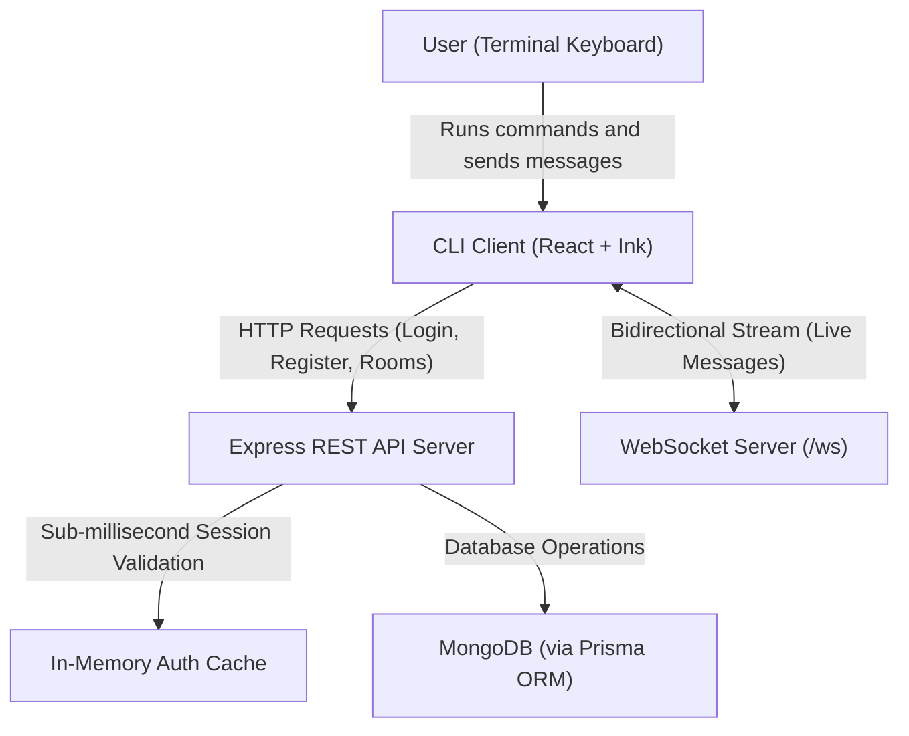

<p align="center">
  
</p>

<h1 align="center">Kairos (kairos-command)</h1>

<p align="center">
  <strong>A real-time, terminal-based chat and file-sharing platform.</strong><br>
  Think Discord or Slack, but living completely inside your command-line interface.
</p>

<p align="center">
  <a href="https://www.npmjs.com/package/kairos-command"></a>
  <a href="https://www.npmjs.com/package/kairos-command"></a>
  <a href="https://github.com/cynicalmindset/Kairos/blob/main/LICENSE"></a>
</p>

---

## Quick Start (Try It in 5 Seconds)

You do not need to install anything or clone this repository to try it out. If you have Node.js installed, open your terminal and run:

```bash
npx kairos-command
```

The terminal interface will start up, connect to the live cloud server, and welcome you to Kairos.

---

## What is this project? (Explained for Beginners)

If you are new to programming or full-stack software development, here is a straightforward breakdown of what Kairos does:

1. **Terminal Client (`CLI/`)**: Instead of clicking buttons in a browser window, you get an interactive text interface right inside your terminal with colored text, status indicators, and keyboard shortcuts.
2. **Real-Time Server (`src/`)**: A backend server running 24/7. When you type a chat message or share a file, the server instantly delivers it to everyone else inside the same room in milliseconds.
3. **Database (`prisma/`)**: Persistent storage powered by **MongoDB** that stores your account, available rooms, and chat records.
4. **Web Landing Page (`client/`)**: A modern website created to showcase the project, featuring an interactive simulated terminal preview.

---

## Architecture: How the Pieces Fit Together

Here is an overview of how the components communicate:



### The 4 Major Parts of the Codebase

| Directory / File | Component | Role |
| :--- | :--- | :--- |
| **`CLI/`** | **Terminal Client** | Built with **Ink** (React adapted for the terminal). It renders the layout, handles keyboard input, and applies terminal styling. |
| **`src/index.ts`** | **Backend Server** | An **Express** application combined with a **WebSocket** server (`ws`) running on Node/Bun that routes chat traffic and manages connections. |
| **`src/auth.ts`** | **Authentication Guard** | Powered by **Better Auth**. It securely hashes passwords, validates logins, and issues **Bearer Tokens** for session management. |
| **`client/`** | **Web Showcase** | A standalone web application built with **Vite, React, and Tailwind CSS** that showcases Kairos to web visitors. |

---

## How a Message Travels (The Life of a Chat)

Here is what happens behind the scenes when you type a message and press **Enter**:

1. **Keystroke Capture**: The Ink CLI captures the text submission in `CLI/src/App.tsx`.
2. **WebSocket Transmission**: The CLI sends a compact JSON packet over an open **WebSocket connection** (`wss://.../ws`) to the backend server.
3. **Server Broadcast**: The server checks which other users are currently active in the same room and sends the message to their terminal clients simultaneously.
4. **Database Storage**: The server saves the message into **MongoDB** using **Prisma**, ensuring your chat history is preserved.

---

## Terminal Slash Commands Cheat Sheet

Inside the CLI, all operations are performed using slash (`/`) commands:

### Account and Identity
- `/register` — Create a new account (Enter Name, Email, and Password).
- `/login` — Sign in with your existing email and password.
- `/logout` — Log out and clear your local authentication token.
- `/profile` — View your account details and current status.

### Rooms and Channels
- `/rooms` — List all available chat rooms.
- `/create <room-name>` — Create a new chat room (example: `/create dev-chat`).
- `/join <room-id>` — Join a room and enter the live conversation.
- `/members` — List all members currently inside your room.
- `/leave` — Exit the current room and return to the lobby.
- `/back` — Return to the previous screen.

### File Sharing
- `/share <path/to/file>` — Send a file to everyone in your current room.
- `/accept <share-id>` — Accept and download an incoming file transfer.
- `/reject <share-id>` — Decline an incoming file transfer.

### General Utilities
- `/help` — Open the in-app command documentation.
- `/clear` — Clear and refresh the terminal screen.
- `/exit` — Close the CLI application.

---

## Running Locally (For Developers)

To run the complete system on your own machine:

### Prerequisites
- [Bun](https://bun.sh) (recommended) or [Node.js](https://nodejs.org) (v18+)
- A [MongoDB Atlas](https://www.mongodb.com/atlas) connection URI or a local MongoDB instance

### 1. Clone and Install
```bash
git clone https://github.com/cynicalmindset/Kairos.git
cd Kairos
bun install
```

### 2. Configure Environment Variables
Create or update your `.env` file in the project root:

```env
DATABASE_URL="your-mongodb-connection-string"
PORT=3000
API_URL="http://localhost:3000"
KAIROS_WS_URL="ws://localhost:3000/ws"
BETTER_AUTH_SECRET="your-random-secret-key"
BETTER_AUTH_URL="http://localhost:3000"
```

### 3. Generate Prisma Client
```bash
bunx prisma generate
```

### 4. Start the Backend Server
```bash
bun run dev
```
The server will start on `http://localhost:3000` with WebSocket support at `ws://localhost:3000/ws`.

### 5. Launch the CLI in Another Terminal
```bash
bun run kairos
```

### 6. (Optional) Run the Web Landing Page
```bash
cd client
bun install
bun run dev
```

---

## Tech Stack Overview

| Technology | Purpose |
| :--- | :--- |
| **Bun** | Fast JavaScript and TypeScript runtime, package manager, and bundler. |
| **React + Ink** | Enables writing standard React component structures (`<Box>`, `<Text>`) that render inside terminal windows. |
| **Express** | Node.js web application framework serving REST API endpoints. |
| **WebSockets (`ws`)** | Low-latency, full-duplex communication channels for real-time messaging. |
| **Better Auth** | Authentication framework providing password hashing and Bearer token management. |
| **Prisma + MongoDB** | Schema-driven Object-Relational Mapping (ORM) connected to a MongoDB document database. |

---

## Publishing Updates (For Maintainers)

To release a new version of the CLI package:

```bash
# 1. Compile the production bundle
bun run build

# 2. Bump the version in package.json (e.g., 1.0.3 -> 1.0.4)

# 3. Publish to npm
npm publish
```

---

## Contributing

Contributions, bug reports, and suggestions are welcome. Feel free to open an issue or submit a pull request.

---

## License

This project is licensed under the MIT License.
