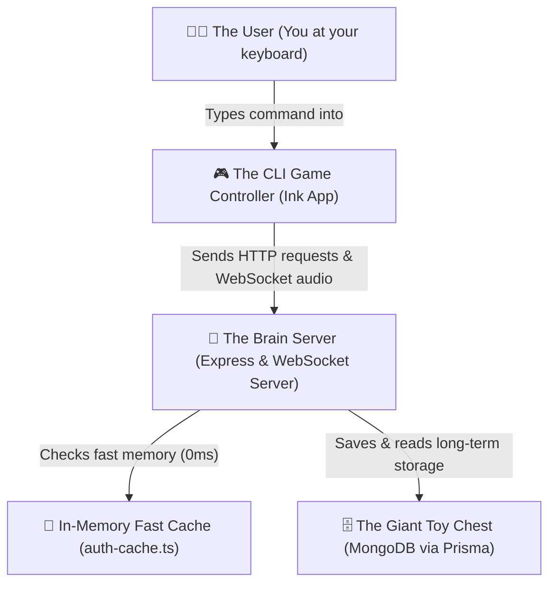

# 🏰 Kairos Explained Like You Are 5 Years Old!

Hello adventurer! 🌟 
Welcome to the magical guide on how **Kairos** works!

---

## 🎯 What is Kairos?
**Kairos** is a **Secret Walkie-Talkie Clubhouse for your Computer Terminal**! 🖥️💬

It lets you:
1. **Create an Account:** Make your secret identity (name, email, and password).
2. **Make Secret Club Rooms:** Like `Lego Club`, `Gaming Den`, or `Top Secret`.
3. **Chat in Real-Time:** When you type something, everyone in the room hears it instantly!
4. **Share Secret Files:** Send photos, files, and drawings to friends inside your room.

---

## 🗺️ The 4 Big Superheroes of Kairos



1. **🎮 The CLI Controller (`CLI/src/App.tsx`)**: The pretty game screen in your terminal with colored text, status spinners, and input bars.
2. **📡 The Brain Server (`src/index.ts`)**: The central headquarters that listens to everyone, forwards messages, and controls who enters which room.
3. **🧠 The Fast Memory Desk (`src/lib/auth-cache.ts`)**: A super-fast notepad the server uses so it never has to wait on slow questions.
4. **🗄️ The Giant Toy Chest (`prisma/schema.prisma` + MongoDB)**: The long-term database where every user, room, message, and file is safely saved forever.

---

## 🔍 Code Walkthrough (Piece by Piece!)

Let's open each door of the castle and see what the code does!

---

### 🚪 Door 1: The Door Guard & Database Toy Chest (`prisma/schema.prisma`)

This file tells the database how to organize all toys into labeled boxes.

```prisma
// 🧸 Box 1: Every person who joins the club
model User {
  id    String @id @map("_id")
  name  String
  email String @unique
  
  memberships RoomMember[] // Rooms they belong to
  messages    Message[]    // Messages they wrote
}

// 🏠 Box 2: The different rooms in the clubhouse
model Room {
  id      String       @id @default(cuid()) @map("_id")
  name    String
  ownerId String
  members RoomMember[]
  messages Message[]
}

// ✉️ Box 3: Every message sent in a room
model Message {
  id        String   @id @default(cuid()) @map("_id")
  content   String
  userId    String
  roomId    String
  createdAt DateTime @default(now())

  // ⚡ Magic Bookmark: Lets the database find messages in 100ms!
  @@index([roomId, createdAt])
}
```

> **5-Year-Old Explanation:**
> Imagine a shelf with three boxes: One for your **Club IDs**, one for the **Room keys**, and one for the **Letters** you wrote. The `@@index` is like putting bright sticky notes on the letters so you can find them in 1 second!

---

### ⚡ Door 2: The Fast Memory Desk (`src/lib/auth-cache.ts`)

Instead of walking all the way across town to check if you are logged in, the server remembers your face on a sticky note!

```typescript
// 📝 Quick memory notepad
const sessionCache = new Map<string, CacheEntry<any>>();

export async function getCachedSession(headers: any) {
  const key = getAuthKey(headers);
  const now = Date.now();

  // 1. If we already know this person and their pass hasn't expired, let them in! (0ms)
  if (key && sessionCache.has(key)) {
    const entry = sessionCache.get(key)!;
    if (entry.expiresAt > now) {
      return entry.data;
    }
  }

  // 2. If it's the first time seeing them, check the database and remember them for next time
  const session = await auth.api.getSession({ headers });
  if (key && session?.user) {
    sessionCache.set(key, { data: session, expiresAt: now + 60000 });
  }

  return session;
}
```

> **5-Year-Old Explanation:**
> If you show the guard your secret club badge once, he says *"I know you, come right in!"* for the next 1 minute without having to look in his giant heavy book every time you speak!

---

### 📬 Door 3: The Message Dispatcher (`src/routes/message.ts`)

When you want to read letters or post a new letter in a room:

```typescript
// 📖 Read letters in a room
router.get("/", async (req, res) => {
  // 1. Guard check (super fast with cache!)
  const session = await getCachedSession(req.headers);
  if (!session?.user) return res.status(401).json({ error: "not logged in" });

  // 2. Are you in this room?
  const isMember = await isMemberCached(session.user.id, roomId);
  if (!isMember) return res.status(403).json({ error: "Not your room!" });

  // 3. Grab the latest 100 letters only!
  const messages = await prisma.message.findMany({
    where: { roomId },
    take: 100,
    orderBy: { createdAt: "asc" },
  });

  return res.json({ messages });
});
```

> **5-Year-Old Explanation:**
> When you walk into a room, the club helper makes sure you are allowed in, and hands you the 100 newest letters on the bulletin board.

---

### 📡 Door 4: The Live Walkie-Talkies (`src/index.ts` & WebSocket)

How do messages appear on your friend's screen without them having to refresh?

```typescript
// 📻 When someone says something on their walkie-talkie:
if (data.type === "new_message") {
  const clients = rooms.get(data.roomId);

  // Broadcast it to everyone holding a walkie-talkie in that room!
  for (const client of clients) {
    if (client.readyState === 1) {
      client.send(JSON.stringify({
        type: "new_message",
        content: data.content,
        user: data.user,
      }));
    }
  }
}
```

> **5-Year-Old Explanation:**
> When you press the talk button on your walkie-talkie and say *"Hello!"*, the central radio tower immediately repeats your voice to every friend tuned into your channel!

---

### 🎮 Door 5: The Terminal Game Controller (`CLI/src/App.tsx`)

This is the interactive UI you see in your black terminal screen.

```tsx
// 💬 Pressing Enter in the chat box
if (activeroom) {
  const content = message.trim();

  // 1. Show message on YOUR screen right away (Optimistic UI - feels instant!)
  setmessages((prev) => [...prev, { content, user: { name: "You" } }]);

  // 2. Save it in the database
  const sentmessage = await sendmessage(activeroom.id, content);

  // 3. Broadcast to all your friends' walkie-talkies!
  sendSocketMessage(activeroom.id, content, sentmessage.user);
}
```

> **5-Year-Old Explanation:**
> When you type a message and press Enter, your screen paints the word right away so you don't wait. In the background, a paper airplane flies to the database and your walkie-talkie shouts the message to everyone else!

---

## 🏃 Life of a Message (The Big Journey)

Here is what happens from the millisecond you press **Enter**:

```
[1] You type "Hi friends!" and hit Enter ⌨️
       ⬇️
[2] CLI screen immediately shows "You: Hi friends!" (0ms) ✨
       ⬇️
[3] Fast memory verifies your ticket (0ms) ⚡
       ⬇️
[4] Message is saved to the MongoDB Toy Chest (~200ms) 💾
       ⬇️
[5] Walkie-talkie broadcasts "Hi friends!" to all other friends in the room (5ms) 📡
       ⬇️
[6] Your friends see "Test User: Hi friends!" on their screens! 🎉
```

---

## 🛠️ Summary of Commands You Can Type in Kairos

| Command | What it does 🎈 |
| :--- | :--- |
| `/login` | Tell the guard who you are with your password |
| `/register` | Create a new secret club membership card |
| `/rooms` | Look at all the club rooms available |
| `/create <name>` | Build a brand new secret room |
| `/join <roomId>` | Walk into a specific room |
| `/members` | See all friends currently in the room |
| `/share <filePath>` | Send a file or picture to everyone in the room |
| `/accept <shareId>` | Download a shared file to your computer |
| `/reject <shareId>` | Decline a shared file |
| `/leave` | Walk out of the current room |
| `/back` | Go back from help/rooms/members menus |
| `/help` | Ask for the instruction guide |
| `/clear` | Wipe the blackboard clean |

---

*Now you know every single secret of how Kairos works! 🚀*
